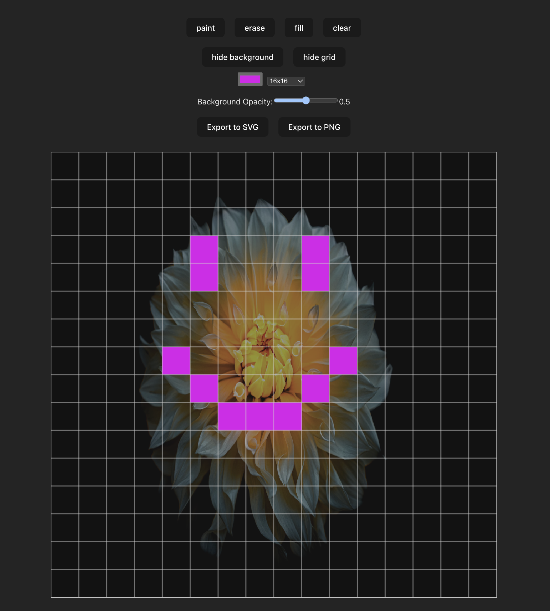

# WIP: Only made to work for me ATM



# React Pixel Art Canvas

A simple, customizable, and headless pixel art canvas component for React applications.

## Installation

```bash
npm install react-pixel-art-canvas
# or
yarn add react-pixel-art-canvas
```

## Basic Concept

This is a "as headless as possible" HTML Canvas pixel art creator React component. It was originally embedded into an app I was building but I wanted something less tied to a particular UI/CSS/Component framework so I abstracted it out into it's own thing. It's very much built for my current usecase but I figured it might work for someone else too (or at least have some copy/pastable bits).

It's composed of 3 canvas elements all stacked up as "layers" - `background | drawing | foreground`

**background** - is used to add background images that you want to "trace" or reference. It can be toggled on/off.

```ts
backgroundCanvasSettings.backgroundVisible: boolean
```

**drawing** - this is were all the actually drawing happens. Cannot be toggled on/off.

**foreground** - this is where we create a grid based on the pixel size set/selected. It can be toggled on/off

```ts
foregroundCanvasSettings.foregroundVisible: boolean
```

## Usage

```tsx
import { useRef } from "react";
import { PixelArtCanvas } from "react-pixel-art-canvas";
import type { Tool, CanvasRef } from "react-pixel-art-canvas";

function App() {
  // This will give you a direct React.ref to the canvas where the drawing happens (drawingCanvas)
  const canvasRef = useRef<CanvasRef>(null);
  // ...as well as a few helper methods
  const clear = canvasRef.current.clearCanvas();
  const svg = canvasRef.current.exportSVG();
  const png = canvasRef.current.exportPNG;

  // Use the component with your desired settings
  return (
    <ReactPixelArtCanvas
      ref={canvasRef}
      settings={{
        GRID_SIZE: gridSize,
        CANVAS_WIDTH: 896, //768 or 896 // canvas width should be divisible by GRID_SIZE(s)
        CANVAS_HEIGHT: 896,
      }}
      selectedColor={color}
      selectedTool={tool}
      backGroundCanvasSettings={{
        backgroundImage: img,
        backgroundOpacity: backgroundOpacity,
        backgroundVisible: showBackground,
      }}
      drawingCanvasSettings={{
        ... nothing to set here ATM
      }}
      foregroundCanvasSettings={{
        foregroundVisible: showForeground,
        gridStrokeColor: "#d1d1d1",
      }}
    />
  );
}
```

## Running the Demo

_Demo created with the default Vite React-TS template_

`npm create vite@latest my-app -- --template react-ts`

TODO: Set up a demo on https://stackblitz.com/edit/vitejs-vite-22ekfvwp?file=index.html&terminal=dev

To run the demo application locally:

1. Clone the repository

```bash
git clone https://github.com/geoffmiller/react-pixel-art-canvas.git
cd react-pixel-art-canvas
```

2. Change to the demo directoy

```bash
cd demo
```

3. Start the demo app

```bash
npm install
npm start
```

The demo will be available at http://localhost:5173

It's "unstyled" in the sense that I did not modify the default CSS that ships with the

## TODO

- clean up
- work on responsive story
- decide if the image importer/cropper/alignment code should live in here
- research [better flood fill algorithm performance](https://shaneosullivan.wordpress.com/2023/05/23/instant-colour-fill-with-html-canvas/) (plenty fast as is)
- write tests
- Set up a demo on [stackblitz](https://stackblitz.com/edit/vitejs-vite-22ekfvwp?file=index.html&terminal=dev) (who wants clone a whole repo just to play with a thing?)
- package for npm
